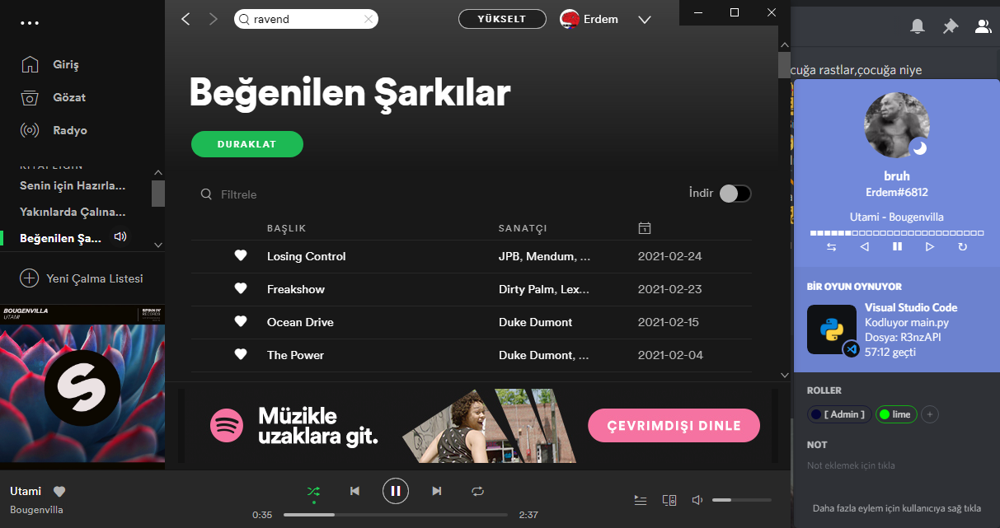
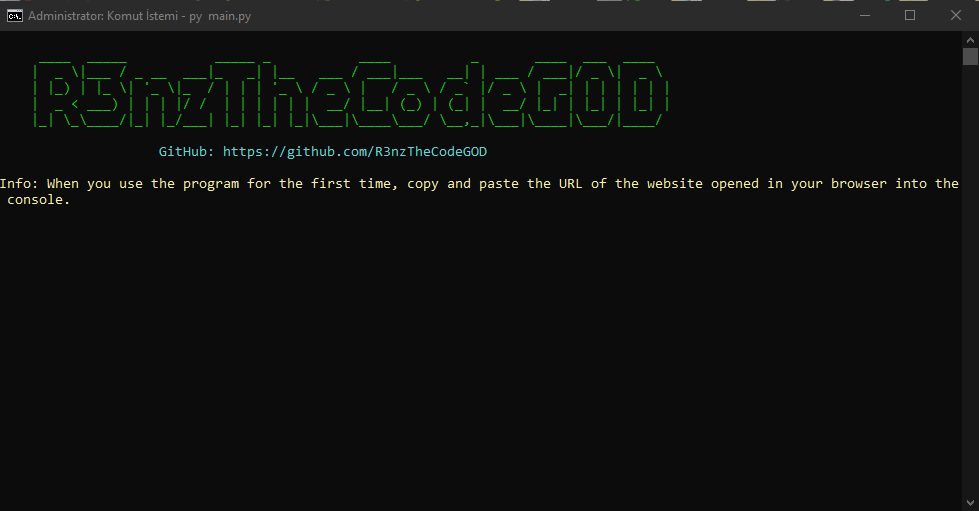

# Discord Spotify Status

## Usage

- Download this repo `git clone`
- adjust your settings `config.ini`
- open cmd first then run code `python main.py`

## config.ini

- **client_id** Spotify api id key
- **client_secret** Spotify api secret key
- **discord_token** Your discord account token
- **redirect_uri** The site you set up on the Spotify api

